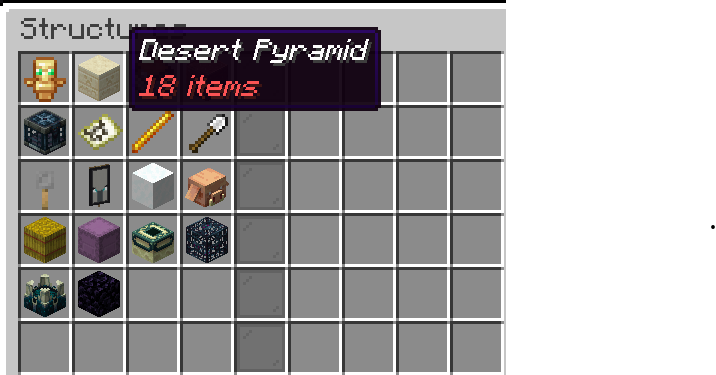
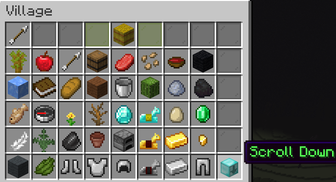

# All & Only Chests

## 📝 Beschreibung / Description
**All & Only Chests** ist ein Minecraft Plugin für PaperMC (Version 1.21.4), das auf der beliebten Challenge basiert, die vom YouTuber und Streamer BastiGHG gespielt wurde. Das Plugin stellt Spieler vor eine spannende Herausforderung:

- 🔨 **Keine Items durch Blockabbau:** Items droppen nicht, wenn Blöcke abgebaut werden, es sei denn, sie wurden zuvor vom Spieler platziert.
- 🎒 **Items nur aus Truhen:** Items können ausschließlich aus Truhen in Strukturen gesammelt werden.
- 🏰 **Strukturen nacheinander looten:** Spieler wählen eine Struktur aus, die sie plündern möchten. Sobald alle Items aus dieser Struktur gefunden wurden, kann die nächste Struktur ausgewählt werden.
- 🏆 **Ziel:** Alle Items aus allen Strukturen zu finden.

**All & Only Chests** is a Minecraft plugin for PaperMC (version 1.21.4) based on the popular challenge played by YouTuber and streamer BastiGHG. The plugin presents players with an exciting challenge:

- 🔨 **No items from block breaking:** Items do not drop when blocks are broken unless they were placed by the player beforehand.
- 🎒 **Items only from chests:** Items can only be collected from chests in structures.
- 🏰 **Loot structures one by one:** Players select a structure to loot. Once all items from that structure are found, the next structure can be chosen.
- 🏆 **Objective:** Find all items from all structures.

---

## ⚙️ Installation / Installation
1. 📥 Lade die neueste Version von **All & Only Chests** herunter.  
   📥 Download the latest version of **All & Only Chests**.
2. 📂 Lege die Plugin-Datei (`.jar`) in den `plugins`-Ordner deines PaperMC-Servers.  
   📂 Place the plugin file (`.jar`) in the `plugins` folder of your PaperMC server.
3. 🔄 Starte den Server neu.  
   🔄 Restart the server.
4. ✅ Stelle sicher, dass die Berechtigungen korrekt konfiguriert sind (siehe unten).  
   ✅ Ensure the permissions are correctly configured (see below).

---

## 🛠️ Befehle / Commands

### `/structures`
- 🗂️ **Beschreibung:** Öffnet ein GUI, in dem eine Struktur ausgewählt werden kann.  
  **Description:** Opens a GUI where a structure can be selected.
- 🔑 **Permission:** `AllAndOnlyChests.command.structures`

### `/structure finish`
- 🛑 **Beschreibung:** Beendet die aktuell ausgewählte Struktur, z. B. wenn ein Item verbuggt ist.  
  **Description:** Ends the currently selected structure, for example, if an item is bugged.
- 🔑 **Permission:** `AllAndOnlyChests.command.structure.finish`

### `/scoreboard toggle`
- 📊 **Beschreibung:** Aktiviert oder deaktiviert das Scoreboard.  
  **Description:** Toggles the scoreboard on or off.
- 🚫 **Permission:** Keine erforderlich.  
  **Permission:** None required.

### `/save`
- 💾 **Beschreibung:** Speichert den aktuellen Fortschritt manuell.  
  **Description:** Manually saves the current progress.
- 🔑 **Permission:** `AllAndOnlyChests.command.save`

---

## 🔄 Automatisches Speichern / Auto Save
- Der Fortschritt wird automatisch gespeichert, wenn:  
  Progress is automatically saved when:
  - Der letzte Spieler den Server verlässt.  
    The last player leaves the server.
  - Der Server mit dem Befehl `/stop` angehalten wird.  
    The server is stopped using the `/stop` command.

---

## 🖼️ GUI

  
**Structure Selection GUI**

  
**Items GUI**

---

## 📜 Lizenz / License
Dieses Werk steht unter der Creative Commons Attribution-NonCommercial 4.0 International Lizenz.  
Mehr Informationen unter: https://creativecommons.org/licenses/by-nc/4.0/  
This work is licensed under the Creative Commons Attribution-NonCommercial 4.0 International License.  
More information at: https://creativecommons.org/licenses/by-nc/4.0/

---

Viel Spaß beim Spielen der **All & Only Chests**-Challenge!  
Have fun playing the **All & Only Chests** challenge!
